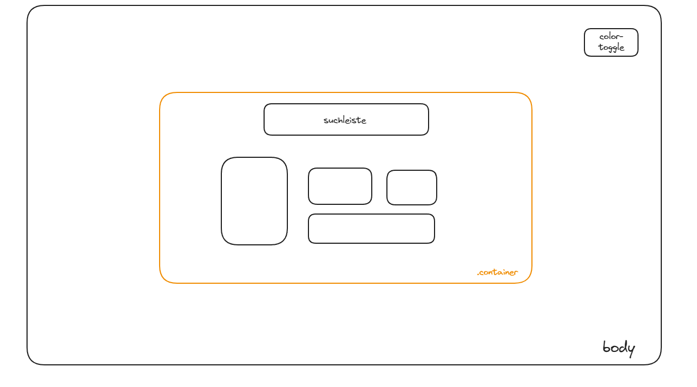

# Wetter-Website

Dieses Projekt ist Teil des Hackathons von [Kevin Chromik](https://www.youtube.com/@KevinChromik).

Aufgabe 1 des Hackathons ist es, die Wetter API von [Open Meteo](https://open-meteo.com/) zu nutzen. Ich habe mich dazu entschieden eine Website zu programmieren und dort die API einzubinden.

## Mockup

Das soll nur ein grobes Design von der Website sein. Ich werde eventuell Dinge mit der Zeit anpassen

## Funktionen

Ich möchte nur den heutigen Tag sehen, wie warm / kalt es wird und ob es regnet.
Mich interessiert garnicht, wie das Wetter in 5 Tagen sein wird, die Luftqualität oder
der UV-Index. Es soll einfach nur ganz minimalistisch und ästhetisch sein.

